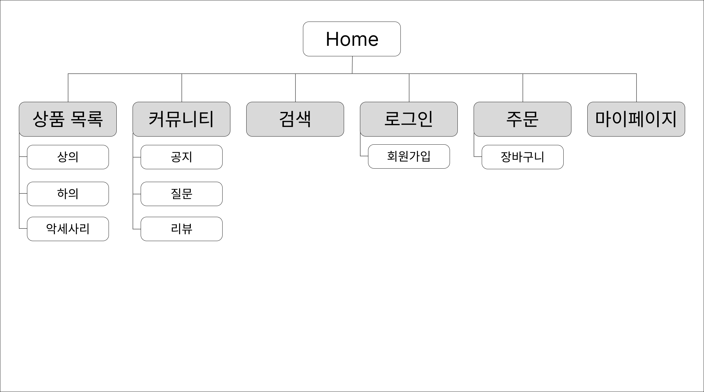
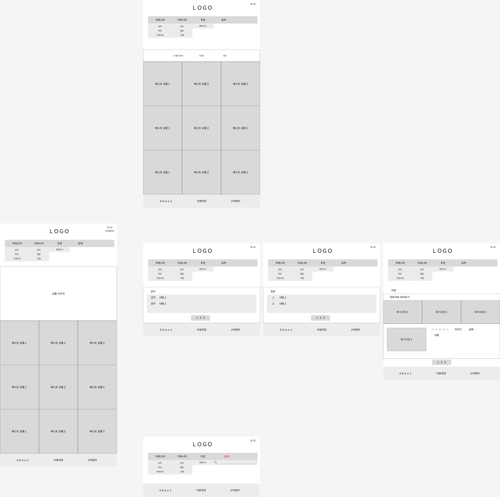

# 🛒 Simplyu 쇼핑몰 웹사이트
**자신만의 취향과 심플한 감성을 담아낸 온라인 쇼핑몰 웹사이트**
https://zerose219.github.io/simplyu-site/

---

## 💻 개발환경
- **IDE**: Visual Studio Code (VSCode)
- **OS**: Windows 11
- **기술 스택**: HTML / CSS / JavaScript
- **버전 관리**: Git / GitHub
- **배포**: GitHub Pages

---

## 📄 페이지별 기능 정의

| 페이지 | 설명 |
|--------|------|
| **Home** | 상단 네비게이션 / 메인 배너 / 추천 상품 영역 / 푸터 |
| **Shop (category.html)** | 드롭다운 메뉴(상의/하의/악세사리) → URL 파라미터로 상품 필터링, 하위 필터 버튼(예: 긴팔, 반팔 등), 상품 카드 클릭 시 상세페이지 이동 |
| **Community (community.html)** | 공지 / 질문 / 리뷰 탭 필터링, 각각의 콘텐츠 카드 형태로 표시 |
| **Login / Join (login.html / join.html)** | 이메일/비밀번호 로그인 및 회원가입, 입력 유효성 검사 |
| **Product Detail (product.html)** | 상품 클릭 시 상세페이지로 이동 (🛠️ 구현 예정) |
| **MyPage (mypage.html)** | 회원 정보 확인, 수정, 비밀번호 변경, 회원 탈퇴 버튼 포함 |

---

## ✨ 주요 기능

- **상품 카테고리 드롭다운 메뉴**
  - URL 파라미터에 따라 `상의`, `하의`, `악세사리` 탭 전환
- **카테고리별 하위 필터 버튼 자동 생성**
  - 상의 → 전체 / 긴팔 / 반팔 / 셔츠
  - 하의 → 전체 / 긴바지 / 반바지 / 슬랙스
- **필터 버튼 클릭 시 상품 카드 실시간 필터링**
- **상품 카드 클릭 시 상세페이지(product.html) 이동 가능하도록 설계**
- **커뮤니티 탭 (공지/질문/리뷰) UI 필터링 구현**

---

## 🗺️ 사이트맵 (Figma)

## 🖋️ 와이어프레임 (Figma)

---

## ✅ 현재 구현된 항목

- 공통 레이아웃 (헤더 / 네비게이션 / 푸터)
- 상품 목록 페이지 (카테고리별 필터링 기능 포함)
- 커뮤니티 탭 UI 구현 (공지 / 질문 / 리뷰)
- 로그인 / 회원가입 페이지
- 마이페이지 틀 구성
- GitHub Pages 배포 완료
- 이미지 에셋 구조 정리 및 적용

---

## 🚧 향후 작업 예정

- 상품 상세 페이지(product.html) 제작 및 상품 ID 전달 처리
- 장바구니 기능 추가 (수량, 합계 계산 등)
- 주문/결제 안내 페이지 구현
- 검색 기능 구현 (키워드 기반 필터링)
- 커뮤니티 기능 고도화 (댓글, 후기 작성 등)
- 반응형 웹 전체 적용
- 회원가입 시 로컬 스토리지/세션 처리 (로그인 상태 유지)
